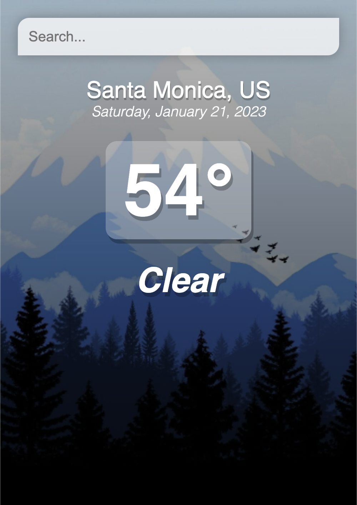

# Weather App

Followed Tyler Pott's [Vue Weather App tutorial](https://www.youtube.com/watch?v=JLc-hWsPTUY&t=246s) on YouTube and learned how to build my first project on Vue.

## Table of Contents

- [Overview](#overview)
  - [Goals](#goals)
  - [Screenshots](#screenshots)
  - [Built with](#built-with)

## Overview

### Learning Goals

- Interact with OpenWeatherMap API in Vue
- Data binding (one-way & two-way)
- Create event listeners
- Conditional display

### Screenshot

### Built with

- HTML, CSS, JavaScript, Vue

